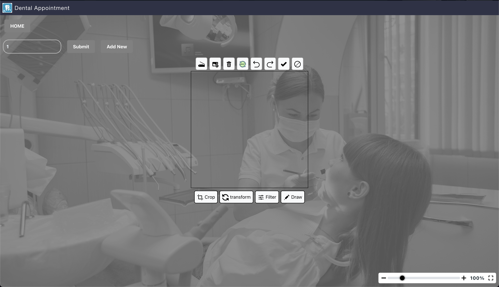

# CV Dental Application Documentation

## Preview:

## Overview

This documentation part consists of the frontend part of the project

## Components

### App.vue

This is the main component of the application. It serves as the root component where other components are injected.

### AddImg.vue
Part of the scan directory
The script section of the component starts by importing several image files. These images are used as the sources for the img elements in the template.

The component's data function returns an object with a single property, buttonDetails, which is an array of objects. Each object represents a button and contains an id, an img (the source of the button's image), a title (the title of the button), and a method (the method to be called when the button is clicked).

### EditImg.vue
Part of the scan directory
Contains the Methods for ->
Crop
Transform
Draw
Filter
Rotate
Replace
Cancel
Zoom Scaling
Move

### ScanComp.vue
Part of the scan directory

Child component responsible for adding images.
Emits events for scanning, uploading, deleting, resetting, undoing, redoing, finishing, and canceling actions.
EditImg

Child component responsible for editing images.
Emits events for cropping, resetting filters, rotating, drawing, applying changes, canceling actions, and more.
Data
canvas: Fabric.js canvas instance for image manipulation.
canvasBGColor: Background color of the canvas.
canvasWidth: Width of the canvas.
canvasHeight: Height of the canvas.
currentImage: Currently selected image object on the canvas.
img: Image object for manipulation.
replaceBtnIcn: Icon for replacement button.
cancelBtnIcn: Icon for cancellation button.
connection: WebSocket connection for image data.
selectionRect: Selection rectangle object for cropping.
actionStack: Stack to keep track of canvas actions.
currentActionIndex: Index to track the current action in the stack.
file: File object for image uploading.
reader: FileReader object for reading image data.
fileName: Name of the uploaded file.
Methods
scanImg: Initiates image scanning.
uploadImg: Handles image uploading.
delScanImg: Deletes the scanned image.
resetImg: Resets the image to its initial state.
undoChange: Undoes the last action.
redoChange: Redoes the undone action.
doneScan: Finishes the scanning process.
cancelScan: Cancels the scanning process.
And more methods for cropping, rotating, filtering, drawing, transforming, zooming, and handling connections.
Lifecycle Hooks
mounted: Initializes the component and establishes a WebSocket connection.
Styles
Custom styles scoped to the component.

### MountComp.vue
This Vue component renders a grid layout for scanning and editing images.
 It organizes buttons for scanning and editing images in a structured grid format.
Components
This component does not use any child components.

Data
isAdded: Array representing the status of each grid item, indicating whether an image is added or not.
img: Image icon used for grid items.
ids: Array of IDs for grid items.
Methods
clickAdd: Marks the clicked grid item as added and emits a 'scan' event.
clickEdit: Emits a 'scan' event.

### ChartComp.vue
This Vue component renders a dental appointment chart, allowing users to select teeth for scanning or previewing. It provides options for scanning or previewing dental images and displays relevant information about dental diseases.
Components
This component does not use any child components.

Data
buttons: Array of objects containing image paths and titles for tooth buttons.
ids: Array of IDs for tooth buttons.
diseaseData: Array of objects containing titles and descriptions of dental diseases.
previewImages: Array containing paths to preview images.
preview: Path to the currently displayed preview image.
avatar: Path to the sample avatar image.
logo: Path to the dummy logo image.
option: Current selected option ('scan' or 'preview').
diseaseDisplay: Boolean indicating whether disease information is displayed.
current_title: Title of the currently displayed dental disease.
current_dis: Description of the currently displayed dental disease.
Methods
selectedOption: Updates the selected option when a radio button is clicked.
clickTooth: Handles tooth button clicks, emits a 'scan' event if scanning is selected, or updates the preview image if previewing is selected.
setscan: Toggles the scan mode.
setpreview: Toggles the preview mode.
Props
imageUrl: Path to the displayed dental image.
isImageDisplayed: Boolean indicating whether an image is displayed.
fileName: Name of the displayed file.
Lifecycle Hooks
mounted: Initializes the component, populates the preview images array, and sets the preview image and disease display based on props.

## Server =>

Basic design of the database =>

    we will be storing the information of each tooth of every person.

    The information will contain the image, date of appointments, details about the tooth, remarks about the tooth and other information needed for searching  etc.

config.env => the environment variable of the database are defined

mongoConnection.js  => 
    an object db is created to which the environment variable to connect to the database are passed ( defined in config.env)

    mongoose module is imported 

    An async function try to connect to mongoose database

MODEL =>
    xray.js
        this defines the template of the document
        (under the current status if will just be url and details which are string and objects repectively)

UTILS =>
    index.js
        this has modules for email validation and password encryption

        currently redundant for us

    upload.js 
        it contains a promise which uploads the file into the middleware's memory 
     
Controller =>
    xray_controller.js =>
        the modules defined in MODEL and UTILS are imported 
        an instance of the google bucket storage is created and bucket assigned to us ("cvteam") is stored in bucket variable

        then a blob space in bucket to store the image is created and a stream to write it is initialised

        a public url to the space is created 

        a document is made in accordance to the database design and uploaded

        

